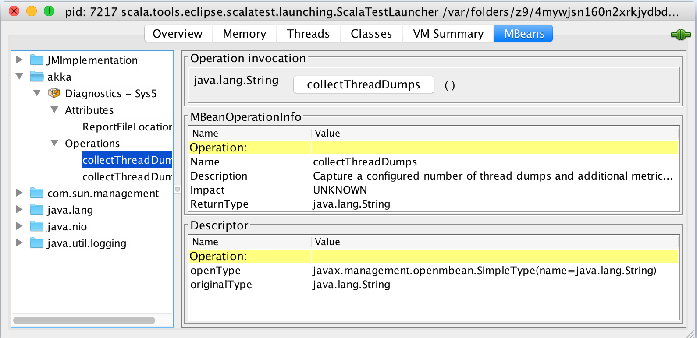

<a id="diagnostics-recorder"></a>
# Akka Diagnostics Recorder

The Akka Diagnostics Recorder writes configuration and system information
to a file that can be attached to your [Lightbend support cases](http://support.lightbend.com/).
The information will help us at Lightbend to give you the best possible support.

It will also register a MBean in the "akka" name space, which can be accessed
from a JMX console such as JConsole. From JMX you can trigger thread dumps
that will also be appended to the file.

@@include[proprietary.md](includes/proprietary.md)

## Using the Diagnostics Recorder

To use the Diagnostics Recorder feature a dependency on the *akka-diagnostics* artifact must be added.

sbt
: @@@vars
```
// Add Lightbend Platform to your build as documented at https://developer.lightbend.com/docs/lightbend-platform/introduction/getting-started/subscription-and-credentials.html
"com.lightbend.akka" %% "akka-diagnostics" % "$version$"
```
@@@

Gradle
:   @@@vars
```
// Add Lightbend Platform to your build as documented at https://developer.lightbend.com/docs/lightbend-platform/introduction/getting-started/subscription-and-credentials.html
dependencies {
  compile group: 'com.lightbend.akka', name: 'akka-diagnostics_$scala.binaryVersion$', version: '$version$'
}
```
@@@

Maven
: @@@vars
```
<!-- Add Lightbend Platform to your build as documented at https://developer.lightbend.com/docs/lightbend-platform/introduction/getting-started/subscription-and-credentials.html -->
<dependency>
  <groupId>com.lightbend.akka</groupId>
  <artifactId>akka-diagnostics_$scala.binaryVersion$</artifactId>
  <version>$version$</version>
</dependency>
```
@@@

@@include[includes/common.md](includes/common.md) { #find-credentials }

When this dependency is included the Diagnostics Recorder is automatically run when the *ActorSystem*
is started.

## File Location

The diagnostics report file is by default created in directory named `akka-diagnostics` in
the current working directory. This can be changed with configuration:

@@snip [DiagnosticsRecorderSpec.scala](/akka-diagnostics/src/test/scala/com/lightbend/akka/diagnostics/DiagnosticsRecorderSpec.scala) { #dir }

The report file name contains the name of the actor system name and remote address if any.

The file is overwritten if the actor system is restarted with same name and remote address.
If the actor system is configured with `port=0` a new file will be created for each
used port, which will lead to possibly quite a lot of files over time. It might make sense
to clear the directory from such files before starting the actor system.

## Configuration and system information

When the actor system is started the Diagnostics Recorder collects configuration and system
information and writes to the diagnostics report file. This information includes:

 * Start time in UTC
 * Akka version
 * full classpath
 * configuration warnings reported by the @ref:[Config Checker](config-checker.md#config-checker)
 * application configuration and JVM system properties
 * JVM and system metrics such as
    * heap and memory pool settings
    * available processors

### Sensitive configuration

The diagnostics report file is in human readable JSON format so you can inspect it
before sending it to Lightbend.

Some configuration properties might not be appropriate to share with others
and such properties can be excluded from the diagnostics report by adding
the paths of the properties to the `akka.diagnostics.recorder.sensitive-config-paths`
configuration string list. By default the following properties/sections are excluded:

@@snip [reference.conf](/akka-diagnostics/src/main/resources/reference.conf) { #diagnostics-recorder-sensitive }

## Thread Dumps

The Diagnostics Recorder registers a JMX MBean in the "akka" name space, which can be accessed
from a JMX console such as JConsole. From JMX you can trigger thread dumps
that will also be appended to the diagnostics report file.



When you click the `collectThreadDumps` button a number of thread dumps are collected.
The number of thread dumps can be configured with:

@@snip [DiagnosticsRecorderSpec.scala](/akka-diagnostics/src/test/scala/com/lightbend/akka/diagnostics/DiagnosticsRecorderSpec.scala) { #thread-dumps-count }

There is also a `collectThreadDumps` operation  with a `count` parameter in case you want to
collect more or less than the configured number of thread dumps.

There is a delay between each thread dump, which can be configured with:

@@snip [DiagnosticsRecorderSpec.scala](/akka-diagnostics/src/test/scala/com/lightbend/akka/diagnostics/DiagnosticsRecorderSpec.scala) { #thread-dumps-interval }

In addition to the thread dump some basic metrics are also captured and written to the file, such as:

 * system load average
 * heap memory and non-heap usage
 * GC collection count and time

To be able to access JMX on remote machines (e.g. cluster nodes) you must enable remote
monitoring and management when starting the JVMs, as described in
[Monitoring and Management Using JMX Technology](http://docs.oracle.com/javase/7/docs/technotes/guides/management/agent.html)

## Akka Management Integration

When using Akka Management the config checker can be accessed through the Akka Management HTTP endpoints  
`akka.diagnostics.management.enabled` is set to `true` (default is `false`). 

@@@ warning

Note that you should make sure your Akka Management endpoint
is properly secured with HTTPS and authentication before enabling this as it may leak potentially sensitive details
about the system or potentially be used for a DoS attack.

@@@

The following paths are available, all returning JSON:

 * GET `/diagnostics/startup-info` - the same system and config information as dumped to a file on startup
 * GET `/diagnostics/thread-dump` - a thread dump is taken triggered immediately by the call
 * GET `/diagnostics/config-check` - the configuration of the app is checked with the config checker for problems and a report of that is returned.

## Disable

It is possible to disable the recorder completely with:

@@snip [DiagnosticsRecorderSpec.scala](/akka-diagnostics/src/test/scala/com/lightbend/akka/diagnostics/DiagnosticsRecorderSpec.scala) { #disabled }

It is possible to disable the JMX feature but still enable other parts of the recorder:

@@snip [DiagnosticsRecorderSpec.scala](/akka-diagnostics/src/test/scala/com/lightbend/akka/diagnostics/DiagnosticsRecorderSpec.scala) { #jmx-disabled }

## Configuration

Below is the configuration of the Diagnostics Recorder, which you may amend to adjust its behavior.

@@snip [reference.conf](/akka-diagnostics/src/main/resources/reference.conf) { #diagnostics-recorder }
