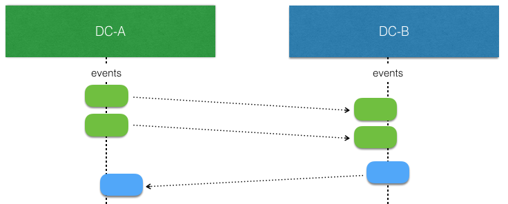
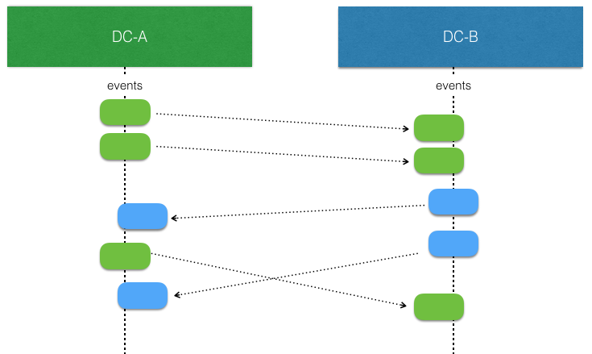
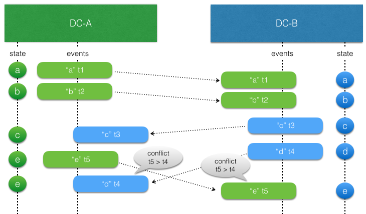
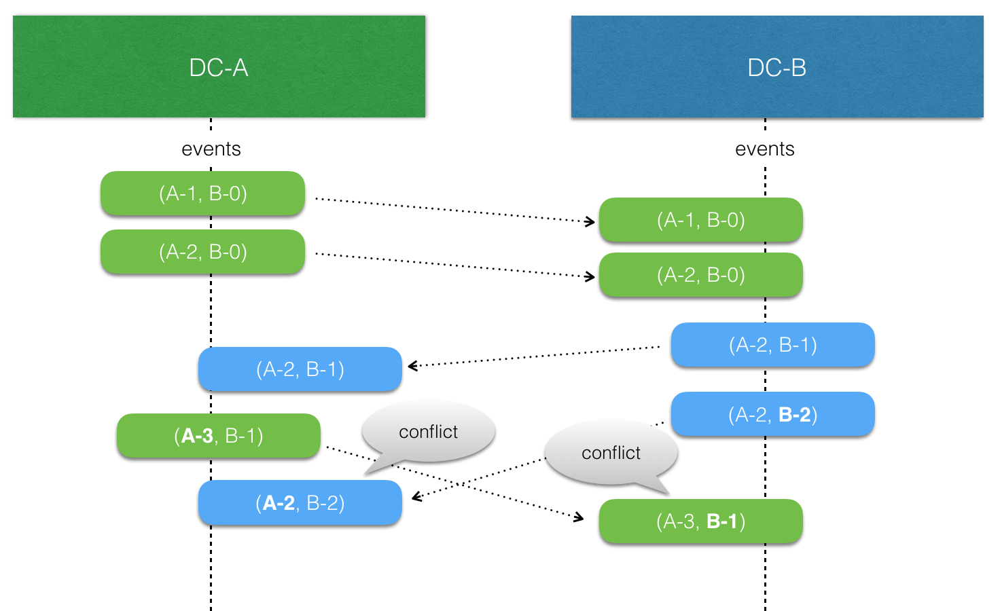

# Akka Multi-DC Persistence

@@@ index

* [Testing](testing.md)
* [Cassandra](cassandra.md)
* [Examples](examples.md)

@@@


This chapter describes how @extref:[Akka Persistence](akka:persistence.html) can be used across multiple data centers (DC), availability zones or regions.

@@@ warning

This module has been replaced in open source Akka with [Replicated Event Sourcing](https://doc.akka.io/docs/akka/current/typed/replicated-eventsourcing.html). 

@@@

@@@ warning

This module is currently marked as @extref:[May Change](akka:common/may-change.html) in the sense of 
that the API might be changed based on feedback from initial usage.
However, the module is ready for usage in production and we will not break serialization format of 
messages or stored data.

@@@

@@include[proprietary.md](../includes/proprietary.md)

## Akka Persistence basics

The @extref:[reference documentation](akka:persistence.html) describes all details of Akka Persistence but here is a short summary in case you are not familiar with the concepts.

Akka persistence enables stateful actors to persist their internal state so that it can be recovered when an actor is started, restarted after a JVM crash or by a supervisor, or migrated in a cluster. The key concept behind Akka persistence is that only changes to an actor’s internal state are persisted but never its current state directly (except for optional snapshots). Such stateful actors are recovered by replaying stored changes to these actors from which they can rebuild internal state.

This design of capturing all changes as domain events, which are immutable facts of things that have happened, is known as [event sourcing](https://msdn.microsoft.com/en-us/library/jj591559.aspx)

Akka persistence supports event sourcing with the @scala[`PersistentActor` trait]@java[`AbstractPersistentActor` abstract class]. An actor that extends this @scala[trait]@java[class] uses the
`persist` method to persist and handle events. The behavior of @scala[a `PersistentActor`]@java[an `AbstractPersistentActor`]
is defined by implementing @scala[`receiveRecover`]@java[`createReceiveRecover`] and @scala[`receiveCommand`]@java[`createReceive`]. More details and examples can be found in the @extref:[Akka documentation](akka:persistence.html#event-sourcing).

Another excellent article about "thinking in Events" is [Events As First-Class Citizens](https://hackernoon.com/events-as-first-class-citizens-8633e8479493) by Randy Shoup.
It is a short and recommended read if you're starting developing Events based applications. 

## Motivation

There can be many reasons for using more than one data center, such as:

* Redundancy to tolerate failures in one location and still be operational.
* Serve requests from a location near the user to provide better responsiveness.
* Balance the load over many servers.

Akka Persistence is using event sourcing that is based on the single writer principle, which means that there can only be one active instance of a `PersistentActor` with a given `persistenceId`. Otherwise, multiple instances would store interleaving events based on different states, and when these events would later be replayed it would not be possible to reconstruct the correct state.

This restriction means that the single persistent actor can only live in one data center and would not be available during network partitions between the data centers. It is difficult to safely fail over the persistent actor from one data center to the other because:

* The underlying data store might not have replicated all data when network partition occured, meaning that some updates would be lost if starting the persistent actor in the other data center. It would be even more problematic if the data is later replicated when the network partition heals, resulting in similar problems as with multiple active persistent actors.
* To avoid above problem with lost or delayed data one could write all data with `QUORUM` consistency level across all data centers, but that would be very slow.
* Detecting problem and failing over to another data center takes rather long time if it should be done with high confidence. Using ordinary Cluster Sharding and @ref:[Split Brain Resolver](../split-brain-resolver.md) would mean downing all nodes in a data center, which is likely not desired. Instead, one would typically like to wait until the network partition heals and accept that communication between the data centers is not possible in the meantime.

## Approach

What if we could relax the single writer principle and allow persistent actors to be used in an active-active mode? The consistency boundary that we get from the ordinary persistent actor is nice and we would like to keep that within a data center, but network partitions across different data centers should not reduce availability. In other words, we would like one persistent actor instance in each data center and the persisted events should be replicated across the data centers with eventual consistency. Eventually, all events will be consumed by replicas in other data centers.

This new type of persistent replicated actor is called `ReplicatedEntity`.

When there is no network partitions and no concurrent writes the events stored by a `ReplicatedEntity` in one data center can be replicated and consumed by another (corresponding) instance in another data center without any concerns. Such replicated events can simply be applied to the local state.



The interesting part begins when there are concurrent writes by `ReplicatedEntity` instances in different data centers. That is more likely to happen when there is a network partition, but it can also happen when there are no network issues. They simply write at the "same time" before the events from the other side have been replicated and consumed.



The `ReplicatedEntity` has support for resolving such conflicts but in the end the logic for applying events to the state of the entity must be aware of that such concurrent updates can occur and it must be modeled to handle such conflicts. This means that it should typically have the same characteristics as a Conflict Free Replicated Data Type (CRDT). With a CRDT there are by definition no conflicts and the events can just be applied. The library provides some general purpose CRDTs, but the logic of how to apply events can also be defined by an application specific function.

For example, sometimes it's enough to use application specific timestamps to decide which update should win.

Strategies for resolving conflicts are described in detail later in this documentation.

To be able to support these things the `ReplicatedEntity` has a different API than the `PersistentActor` in Akka Persistence. The concepts should be familiar and migrating between the APIs should not be difficult. Events stored by a `PersistentActor` can be read by a `ReplicatedEntity`, meaning that it's possible to migrate an existing application to use this feature. There are also migration paths back to `PersistentActor` if that would be needed. The API is similar to [Lagom's PersistentEntity](https://www.lagomframework.com/documentation/1.3.x/scala/PersistentEntity.html), but it has the full power of an `Actor` if needed.

The solution is using existing infrastructure for persistent actors and Akka persistence plugins, meaning that much of it has been battle tested.

[Cassandra](https://cassandra.apache.org/) is currently the only supported data store, but the solution is designed to allow for other future implementations.

The replication mechanism of the events is taking advantage of the multi data center support that exists in Cassandra, i.e. the data is replicated by Cassandra.

### When to not use it

Akka Multi-DC Persistence is not suitable for:

* When all you need is a simple CRUD with last-writer wins, or optimistic locking semantics. Event sourcing and Multi-DC event sourcing is then overkill for the problem you are trying to solve and will increase complexity of the solution.
* When you need to ensure global constraints at all times. For example ensuring that an inventory balance is never negative even if updated from several data centers. Then you need a fully consistent system and Multi-DC Persistence is favoring availability.
* When read-modify-write transactions across several data centers are needed.

## Dependency

To use the multi data center persistence feature a dependency on the *akka-persistence-multi-dc* artifact must be added.

sbt
:   @@@vars
```
// Add Lightbend Platform to your build as documented at https://developer.lightbend.com/docs/lightbend-platform/introduction/getting-started/subscription-and-credentials.html
"com.lightbend.akka" %% "akka-persistence-multi-dc" % "$version$"
```
@@@

Gradle
:   @@@vars
```
// Add Lightbend Platform to your build as documented at https://developer.lightbend.com/docs/lightbend-platform/introduction/getting-started/subscription-and-credentials.html
dependencies {
  compile group: 'com.lightbend.akka', name: 'akka-persistence-multi-dc_$scala.binaryVersion$', version: '$version$'
}
```
@@@

Maven
:   @@@vars
```
<!-- Add Lightbend Platform to your build as documented at https://developer.lightbend.com/docs/lightbend-platform/introduction/getting-started/subscription-and-credentials.html -->
<dependency>
  <groupId>com.lightbend.akka</groupId>
  <artifactId>akka-persistence-multi-dc_$scala.binaryVersion$</artifactId>
  <version>$version$</version>
</dependency>
```
@@@

@@include[../includes/common.md](../includes/common.md) { #find-credentials }

To use it together with Akka 2.6 you have to override the following Akka dependencies by defining them
explicitly in your build and define the Akka version to one that you are using.

@@dependency[sbt,Maven,Gradle] {
  group=com.typesafe.akka
  artifact=akka-persistence-query
  version="$akka.version26$"
  group2=com.typesafe.akka
  artifact2=akka-persistence
  version2="$akka.version26$"
  group3=com.typesafe.akka
  artifact3=akka-cluster-sharding
  version3="$akka.version26$"
  group4=com.typesafe.akka
  artifact4=akka-cluster-tools
  version4="$akka.version26$"
}

## Getting started

A template project is available as Get Started download  
[for Java](https://developer.lightbend.com/start/?group=akka&project=akka-samples-persistence-dc-java)
or [for Scala](https://developer.lightbend.com/start/?group=akka&project=akka-samples-persistence-dc-scala).
It contains instructions of how to run it in the README file.

### ReplicatedEntity stub

This is what a `ReplicatedEntity` class looks like before filling in the implementation details:

Scala
:   @@snip [post1](/akka-persistence-multi-dc-tests/src/test/scala/docs/scaladsl/Post1.scala) { #post1 }

Java
:   @@snip [post1](/akka-persistence-multi-dc-tests/src/test/java/docs/javadsl/Post1.java) { #post1 }

* `Command` - the super class/interface of the commands
* `Event` - the super class/interface of the events
* `State` - the class of the state

`initialState` is an abstract method that your concrete subclass must implement to define the `State` when the entity is first created.

`commandHandler` is an abstract method that your concrete subclass must implement to define the actions of the entity. `CommandHandler` defines command handlers and optional functions for other signals, e.g. `Termination` messages if `watch` is used.

`eventHandler` is the event handler that updates the current state when an event has been persisted.

### Command Handlers

The commands for this example:

Scala
:   @@snip [commands](/akka-persistence-multi-dc-tests/src/test/scala/docs/scaladsl/BlogCommand.scala) { #full-example }

Java
:   @@snip [commands](/akka-persistence-multi-dc-tests/src/test/java/docs/javadsl/BlogCommands.java) { #full-example }

The function that processes incoming commands is defined by the mandatory `commandHandler`:

Scala
:   @@snip [post2](/akka-persistence-multi-dc-tests/src/test/scala/docs/scaladsl/Post2.scala) { #command-handler }

Java
:   @@snip [post2](/akka-persistence-multi-dc-tests/src/test/java/docs/javadsl/Post2.java) { #command-handler }

The command handler
@scala[can be built from a function with 3 parameters for the `Command`, the `CommandContext` and current `State`.]
@java[can be built from functions with 3 parameters for the `Command`, the `CommandContext` and current `State`.]

A command handler returns an `Effect` directive that defines what event or events, if any, to persist. Use the `persist`, `none` or `unhandled` methods of @scala[`Effect`]@java[`Effect()`] to create the `Effect` directives:

* @scala[`Effect.persist`]@java[`Effect().persist`] can be used to persist one or many events.
This method is overloaded and offers few variants. You can pass one `Event`, @scala[an `immutable.Seq[Event]`]@java[a `List<Event>`]  or an @scala[`Option[Event]`]@java[`Optional<Event>`].
Events are atomically persisted, i.e. all events are stored or none of them are stored if there is an error
* @scala[`Effect.none`]@java[`Effect().none`] no events are to be persisted, for example a read-only command
* @scala[`Effect.unhandled`]@java[`Effect().unhandled`] the command is unhandled (not supported) in current state

External side effects can be performed after successful persist with the `andThen` function. In the above example a reply is sent to the `sender`. Note that current state after applying the event is passed as parameter to the `andThen` function.

The command can be validated before persisting state changes. Note that the updated state is passed as a parameter to the command handler function:

Scala
:   @@snip [post2](/akka-persistence-multi-dc-tests/src/test/scala/docs/scaladsl/Post2.scala) { #validate-command }

Java
:   @@snip [post2](/akka-persistence-multi-dc-tests/src/test/java/docs/javadsl/Post2.java) { #validate-command }

A `ReplicatedEntity` may also process commands that do not change application state, such as query commands or commands that are not valid in the entity's current state (such as a bid placed after the auction closed).
Instead of using @scala[`Effect.persist`]@java[`Effect().persist`] you can simply return @scala[`Effect.none`]@java[`Effect().none()`] for such read-only commands.
Replies are sent as ordinary actor messages to the `sender` of the context that is passed to the command handler function, or to any other `ActorRef` in the commands or state.

Scala
:   @@snip [post2](/akka-persistence-multi-dc-tests/src/test/scala/docs/scaladsl/Post2.scala) { #read-only-command-handler }

Java
:   @@snip [post2](/akka-persistence-multi-dc-tests/src/test/java/docs/javadsl/Post2.java) { #read-only-command-handler }

The commands must be immutable to avoid concurrency issues that may occur from changing a command instance that has been sent.

You need to create a @extref:[serializer](akka:serialization.html) for the commands so that they can be sent as remote messages in the Akka cluster. We @extref:[recommend against](akka:remoting.html#serialization) using Java serialization.

### Event Handlers

The events for this example:

Scala
:   @@snip [commands](/akka-persistence-multi-dc-tests/src/test/scala/docs/scaladsl/BlogEvent.scala) { #full-example }

Java
:   @@snip [commands](/akka-persistence-multi-dc-tests/src/test/java/docs/javadsl/BlogEvents.java) { #full-example }

When an event has been persisted successfully the current state is updated by applying the event to the current state. The method for updating the state is `eventHandler` and it must be implemented by the concrete `ReplicatedEntity` class.

Scala
:   @@snip [post2](/akka-persistence-multi-dc-tests/src/test/scala/docs/scaladsl/Post2.scala) { #event-handler }

Java
:   @@snip [post2](/akka-persistence-multi-dc-tests/src/test/java/docs/javadsl/Post2.java) { #event-handler }

The event handler returns the new state. The state must be immutable, so you return a new instance of the state. Current state is passed as a parameter to the event handler function. The same event handler is also used when the entity is started up to recover its state from the stored events, and for consuming replicated events and updating the state from those.

In this example we use a timestamp to resolve conflicting concurrent updates. The events such as `BodyChanged` contain a `LwwTime` that holds current time when the event was persisted and an identifier of the data center that persisted it. Greatest timestamp wins. The data center identifier is used if two timestamps are equal, and then the one from the data center sorted first in alphanumeric order wins. Such conflict resolution is often called last writer wins and is described in [more detail later](#resolving-conflicting-updates)

The events must be immutable to avoid concurrency issues that may occur from changing an event instance that is about to be persisted.

You need to create a @extref:[serializer](akka:serialization.html) for the events, which are stored. We @extref:[recommend against](akka:remoting.html#serialization) using Java serialization. When picking serialization solution for the events you should also consider that it must be possible read old events when the application has evolved. Strategies for that can be found in the @extref:[Akka documentation](akka:persistence-schema-evolution.html).

### State

The state for this example:

Scala
:   @@snip [state](/akka-persistence-multi-dc-tests/src/test/scala/docs/scaladsl/BlogState.scala) { #full-example }

Java
:   @@snip [state](/akka-persistence-multi-dc-tests/src/test/java/docs/javadsl/BlogState.java) { #full-example }

The state must be immutable to avoid concurrency issues that may occur from changing a state instance that is about to be saved as snapshot.

You need to create a @extref[serializer](akka:serialization.html) for the state,
because it is stored as snapshot. We @extref:[recommend against](akka:remoting.html#serialization) using Java serialization. When picking serialization solution for the snapshot you should also consider that it might be necessary to read old snapshots when the application has evolved. Strategies for that can be found in the @extref:[Akka documentation](akka:persistence-schema-evolution.html).
It is not mandatory to be able to read old snapshots. If it fails it will instead replay more old events, which might have a performance cost.

### Changing Behavior

For simple entities you can use the same set of command handlers independent of what state the entity is in. The actions can then be defined like this:

Scala
:   @@snip [post3](/akka-persistence-multi-dc-tests/src/test/scala/docs/scaladsl/Post3.scala) { #same-behavior }

Java
:   @@snip [post3](/akka-persistence-multi-dc-tests/src/test/java/docs/javadsl/Post3.java) { #same-behavior }


When the state changes it can also change the behavior of the entity in the sense that new functions for processing commands may be defined.
This is useful when implementing finite state machine (FSM) like entities. The `CommandHandler` can be selected based on current state by
using the @scala[`CommandHandler.byState` factory method. It is a function]@java[`byStateCommandHandlerBuilder`. It defines a mapping]
from current `State` to `CommandHandler`, which is called for each incoming command to select which `CommandHandler` to use to process the command.

This is how to define different behavior for different `State`:

Scala
:   @@snip [post2](/akka-persistence-multi-dc-tests/src/test/scala/docs/scaladsl/Post2.scala) { #behavior }

Java
:   @@snip [post2](/akka-persistence-multi-dc-tests/src/test/java/docs/javadsl/Post2.java) { #behavior }


Scala
:   @@snip [post2](/akka-persistence-multi-dc-tests/src/test/scala/docs/scaladsl/Post2.scala) { #initial-actions }

Java
:   @@snip [post2](/akka-persistence-multi-dc-tests/src/test/java/docs/javadsl/Post2.java) { #initial-actions }


Scala
:   @@snip [post2](/akka-persistence-multi-dc-tests/src/test/scala/docs/scaladsl/Post2.scala) { #postAdded-actions }

Java
:   @@snip [post2](/akka-persistence-multi-dc-tests/src/test/java/docs/javadsl/Post2.java) { #postAdded-actions }


The event handler is always the same independent of state. The main reason for not making the event handler dynamic like the `CommandHandler` is that replicated events may be delayed and all events should be handled independent of what the current state is.

### Minimum configuration

There are a few configuration properties that are needed to enable this feature. Here are required configuration properties for running with a single Akka node and a local Cassandra server:

```
akka.actor {
  provider = cluster
}
akka.remote {
  netty.tcp {
    hostname = "127.0.0.1"
    port = 2552
  }
}
akka.cluster {
  seed-nodes = ["akka.tcp://ClusterSystem@127.0.0.1:2552"]
  multi-data-center.self-data-center = DC-A
}
akka.persistence {
  snapshot-store.plugin = "cassandra-snapshot-store"

  multi-data-center {
    all-data-centers = ["DC-A", "DC-B"]
  }
}
```

### Running the entity

The `ReplicatedEntity` *is not* an `Actor`, but it is run by an actor and have the same message processing semantics as an actor, i.e. each command/message is processed sequentially, one at a time, for a specific entity instance. It also has the same semantics when persisting events as `PersistentActor`, i.e. incoming commands/messages are stashed until the persist is completed.

To start the entity you need to create the `Props` of the actor:

Scala
:   @@snip [running](/akka-persistence-multi-dc-tests/src/test/scala/docs/scaladsl/Running.scala) { #props }

Java
:   @@snip [running](/akka-persistence-multi-dc-tests/src/test/java/docs/javadsl/Running.java) { #props }

The parameters to the `props` are:

* `persistenceIdPrefix` - Prefix for the `persistenceId`. Empty string is a valid prefix if the
  `entityId` itself is globally unique. Note that this can't be changed, since it is part of
  the storage key (`persistenceId`).
* `entityId` - The identifier of the entity.
* `entityFactory` - Factory for creating a new instance of the entity. It has to be a
  factory so that a new instance is created in case the actor is restarted.
* `settings` - Configuration settings.

The `persistenceId` is the concatenation of `persistenceIdPrefix`, `entityId` and the data center identifier,
separated with `|`. This must be a globally unique identifier.

Then you can start the actor with `actorOf`:

Scala
:   @@snip [running](/akka-persistence-multi-dc-tests/src/test/scala/docs/scaladsl/Running.scala) { #actorOf }

Java
:   @@snip [running](/akka-persistence-multi-dc-tests/src/test/java/docs/javadsl/Running.java) { #actorOf }

and send commands as messages via the `ActorRef`.

`ReplicatedEntity` is typically used together with @extref:[Cluster Sharding](akka:cluster-sharding.html) and then the `Props` is obtained with `ReplicatedEntity.clusterShardingProps`. Then the `Props` is registered with the `ClusterSharding` extension and commands sent via the `ActorRef` of the `ShardRegion` like this:

Scala
:   @@snip [running](/akka-persistence-multi-dc-tests/src/test/scala/docs/scaladsl/Running.scala) { #sharding }

Java
:   @@snip [running](/akka-persistence-multi-dc-tests/src/test/java/docs/javadsl/Running.java) { #sharding }

## Resolving conflicting updates

### Conflict Free Replicated Data Types

Writing code to resolve conflicts can be complicated to get right.
One well-understood technique to create eventually-consistent systems is to
model your state as a Conflict Free Replicated Data Type, a CRDT. There are two types of CRDTs;
operation-based and state-based. For the `ReplicatedEntity` the operation-based is a good fit,
since the events represent the operations. Note that this is distinct from the CRDT's implemented
in @extref:[Akka Distributed Data](akka:distributed-data.html),
which are state-based rather than operation-based.

The rule for operation-based CRDT's is that the operations must be commutative — in other words, applying the same events
(which represent the operations) in any order should always produce the same final state. You may assume each event is applied only once, with [causal delivery order](#causal-delivery-order).

The library provides some general purpose CRDT implementations that you can use as the state or part of the state in the entity. However, you are not limited to those types. You can write custom CRDT implementations and more importantly you can implement the application specific `eventHandler` function with the semantics of a CRDT in mind.

A simple example would be a movies watch list that is represented by the general purpose `ORSet` CRDT. `ORSet` is short for Observed Remove Set. Elements can be added and removed any number of times. Concurrent add wins over remove. It is an operation based CRDT where the delta of an operation (add/remove) can be represented as an event.

Such movies watch list example:

Scala
:   @@snip [movie](/akka-persistence-multi-dc-tests/src/test/scala/docs/scaladsl/MovieWatchListDocSpec.scala) { #movie-entity }

Java
:   @@snip [movie](/akka-persistence-multi-dc-tests/src/test/java/docs/javadsl/MovieWatchListDocTest.java) { #import }
    @@snip [movie](/akka-persistence-multi-dc-tests/src/test/java/docs/javadsl/MovieWatchListDocTest.java) { #movie-entity }

The @ref:[Auction Example](auction-example.md) is a more comprehensive example that illustrates how application-specific rules can be used to implement an entity with CRDT semantics.

### Last writer wins

Sometimes it is enough to use timestamps to decide which update should win. Such approach relies on synchronized
clocks, and clocks of different machines will always be slightly out of sync. Timestamps should therefore only be
used used when the choice of value is not important for concurrent updates occurring within the clock skew.

In general, last writer wins means that the event is used if the timestamp of the event is
later (higher) than the timestamp of previous local update, otherwise the event is discarded.
There is no built-in support for last writer wins, because it must often be combined with more application
specific aspects.



There is a small utility class `LwwTime` that can be useful for implementing last writer wins semantics.
It contains a timestamp  representing current time when the event was persisted and an identifier of the
data center that persisted it. When comparing two `LwwTime` the greatest timestamp wins. The data center
identifier is used if the two timestamps are equal, and then the one from the data center sorted first in
alphanumeric order wins.

In this example the `isAfter` method in `LwwTime` is used to compare such timestamps:

Scala
:   @@snip [post2](/akka-persistence-multi-dc-tests/src/test/scala/docs/scaladsl/Post2.scala) { #event-handler }

Java
:   @@snip [post2](/akka-persistence-multi-dc-tests/src/test/java/docs/javadsl/Post2.java) { #event-handler }

When creating the `LwwTime` it is good to have a monotonically increasing timestamp, and for that the `increase`
method in `LwwTime` can be used:

Scala
:   @@snip [post2](/akka-persistence-multi-dc-tests/src/test/scala/docs/scaladsl/Post2.scala) { #command-handler }

Java
:   @@snip [post2](/akka-persistence-multi-dc-tests/src/test/java/docs/javadsl/Post2.java) { #command-handler }

The nature of last writer wins means that if you only have one timestamp for the state the events must represent an
update of the full state, otherwise there is a risk that the state in different data centers will be different and
not eventually converge to the same state.

An example of that would be an entity representing a blog post and the fields `author` and `title` could be updated
separately with events @scala[`AuthorChanged(newAuthor: String)`]@java[`new AuthorChanged(newAuthor)`] and @scala[`TitleChanged(newTitle: String)`]@java[`new TitleChanged(newTitle)`].

Let's say the blog post is created and the initial state of `title=Akka, author=unknown` is in sync in both data centers `DC-A` and `DC-B`.

In `DC-A` author is changed to "Bob" at time `100`. Before that event has been replicated over to `DC-B` the
title is updated to "Akka News" at time `101` in `DC-B`. When the events have been replicated the result will be:

`DC-A`: The title update is later so the event is used and new state is `title=Akka News, author=Bob`

`DC-B`: The author update is earlier so the event is discarded and state is `title=Akka News, author=unknown`

The problem here is that the partial update of the state is not applied on both sides, so the states have diverged and will not become the same.

To solve this with last writer wins the events must carry the full state, such as @scala[`AuthorChanged(newContent: PostContent)`]@java[`new AuthorChanged(newContent)`] and @scala[`TitleChanged(newContent: PostContent)`]@java[`new TitleChanged(newContent)`]. Then the result would eventually be `title=Akka News, author=unknown` on both sides.
The author update is lost but that is because the changes were performed concurrently. More important is that the state
is eventually consistent.

Including the full state in each event is often not desired. An event typically represent a change, a delta. Then one can use several timestamps, one for each set of fields that can be updated together. In the above example one could use one timestamp for the title and another for the author. Then the events could represent changes to parts of the full state, such as @scala[`AuthorChanged(newAuthor: String)`]@java[`new AuthorChanged(newAuthor)`] and @scala[`TitleChanged(newTitle: String)`]@java[`new TitleChanged(newTitle)`].

The above [Getting started example](#getting-started) is using last writer wins.

### Additional information about the events

The `eventHandler` is used both when persisting new events, replaying events, and consuming replicated events. Sometimes it can be
good know the difference of these cases and have some additional meta data about the event. For that purpose you may optionally
override `selfEventHandler` and `replicatedEventHandler`. By default these delegate to `eventHandler`.

The additional information for both these methods:

* `timestamp` - time when the event was persisted as returned by `ReplicatedEntity.currentTimeMillis`,
  which is typically in epoch milliseconds, i.e. milliseconds since midnight, January 1, 1970 UTC
* `sequenceNr` - the sequence number of the event
* `recoveryRunning` - `true` when the event is applied from replay when recovering the state at startup,
  `false` if it was persisted now

Different data centers may have different sequence numbers for their own event log.

For `applyReplicatedEvent` there are also:

* `originDc` the event was persisted by this data center
* `concurrent` see [Detecting concurrent updates](#detecting-concurrent-updates)

### Detecting concurrent updates

There is a feature to enable tracking of causality between events to detect
concurrent updates. The `ReplicatedEventContext` that is passed as parameter to `applyReplicatedEvent` 
has the `concurrent` flag to indicate if an event was persisted with a causal relation to previous event 
here (`concurrent=false`), or if an update occurred in both data centers before the events had been replicated to
the other side (`concurrent=true`).

Here is an example of registry that accept updates when they are in causal order but for
concurrent updates it prefers one data center:

Scala
:   @@snip [BiasedRegistry](/akka-persistence-multi-dc-tests/src/test/scala/akka/persistence/multidc/scaladsl/DetectConcurrentUpdateSpec.scala) { #detect-concurrent-updates }

Java
:   @@snip [BiasedRegistry](/akka-persistence-multi-dc-tests/src/test/java/akka/persistence/multidc/javadsl/BiasedRegistry.java) { #detect-concurrent-updates }

Detecting concurrent updates are done by storing a [version vector](https://en.wikipedia.org/wiki/Version_vector) 
with each event and comparing that with a local version vector when the event is delivered. When using pure CRDTs 
it is typically not needed to care about if an event is concurrent or not, since CRDT operations must be commutative.

## Side effects

The general recommendation for external side effects is to perform them using the `andThen` callbacks. The `andThen` callbacks are called after the events are persisted. In case no events are emitted, e.g. when passing an empty @scala[`immutable.Seq[Event]`]@java[`List<Event>`]or using @scala[`Effect.none`]@java[`Effect().none()`], the callbacks are immediately called.

Side effects from the event handler are generally discouraged, because the event handlers are also used during replay and when consuming replicated events and that would result in undesired re-execution of the side effects.

`recoveryCompleted` can be a good place to based on current state after recovery retry the side effects that were intended to be performed but have not been confirmed yet. You would typically persist one event for the intention to perform the side effect before doing it, and then store an acknowledgment event when it has been confirmed by the destination that is was performed.

One can try best effort to only perform side effects once but to achieve effectively once-and-only-once the destination must be able to de-duplicate retried requests (or the side effect is idempotent in other ways).

Coordination between different data centers for deciding where a side effect should be performed is not provided by the `ReplicatedEntity`. You have to use another tool for such consensus decisions, e.g. ZooKeeper. You could also simply decide that such side effects should only be performed by one data center, but you would still have to handle duplicate attempts.

### Triggers

For some use cases you may need to trigger side effects after consuming replicated events. For example when an auction has been closed in all data centers and all bids have been replicated. Another example could be workflow process that requires confirmation that other data centers have received certain facts (events) before proceeding with next step in the process.

To be able to perform side effects, and also persisting new events, in reaction to consuming events from own or other data centers you can override the method `eventTrigger` in the `ReplicatedEntity`. It is called for all events, but it is not called during recovery. Side effects after recovery should be done in `recoveryCompleted` based on the state.

Here is an example of a workflow process that is using triggers to continue the process when a step has been approved by the authority of all data centers.

Scala
:   @@snip [trigger](/akka-persistence-multi-dc-tests/src/test/scala/docs/scaladsl/TriggerDocSpec.scala) { #trigger }

Java
:   @@snip [trigger](/akka-persistence-multi-dc-tests/src/test/java/docs/javadsl/TriggerDocTest.java) { #trigger }

The @ref:[Auction Example](auction-example.md) is also using triggers.

## Failures

If persistence of an event fails the problem is logged and the actor will unconditionally be stopped.

The reason that it cannot resume when persist fails is that it is unknown if the event was actually
persisted or not, and therefore it is in an inconsistent state. Restarting on persistent failures
will most likely fail anyway since the journal is probably unavailable. It is better to stop the
actor and after a back-off timeout start it again. The `akka.pattern.BackoffSupervisor` actor
is provided to support such restarts.

See @extref:[Akka documentation](akka:persistence.html#failures) of how to use the `BackoffSupervisor`.

## Snapshots

When the entity is started the state is recovered by replaying stored events. To reduce this recovery time the entity
may start the recovery from a snapshot of the state and then only replaying the events that were stored after the snapshot
for that entity.

Such snapshots are automatically saved after a configured number of persisted events. The snapshot if any is automatically
used as the initial state before replaying the events. The interval between snapshots can be configured with the
`akka.persistence.multi-data-center.snapshot-after` setting.

The state must be immutable to avoid concurrency issues that may occur from changing a state instance that is about to be
saved as a snapshot.

The snapshot contains internal state and user-defined state. You need to create a
@extref:[serializer](akka:serialization.html) for the state, because it is stored as snapshot.
We @extref:[recommend against](akka:remoting.html#serialization) using Java serialization.
When picking serialization solution for the snapshot you should also consider that it might be necessary to read old snapshots when the application has evolved.
Strategies for that can be found in the @extref:[Akka documentation](akka:persistence-schema-evolution.html). It is not mandatory to be able to read old snapshots. If it fails it will instead replay more old events, which might have a performance cost.

The snapshots are local to the data center and not transferred or used across different data centers.

## Passivating and stopping entities

When a `ReplicatedEntity` is not used it is good to stop it to reduce resource consumption. A started
entity is not only using memory but also looking for new replicated events from other data centers once in a while
(`cassandra-journal-multi-dc.low-frequency-read-events-interval` config).

When run under sharding the entities will automatically shutdown after an idle period of 90 seconds during which 
the entity did not receive any commands (configurable through `akka.persistence.multi-data-center.auto-passivate-after`). 
Note that this should be set higher than `keep-alive.start-entity-interval` if `keep-alive` is enabled to avoid the
entities repeatedly passivating and then being restarted by the keep-alive.

If a `ReplicatedEntity` at some point explicitly sets a receive timeout that will cause the auto passivation to be
disabled for that entity. You can programmatically disable the auto passivation for an entity by setting the receive 
timeout to @scala[`Duration.Inf`]@java[`Duration.Inf()`]. 

To explicitly passivate an entity running under @extref:[Cluster Sharding](akka:cluster-sharding.html) you can use 
@scala[`Effect.passivate(YourOwnStopCommand)`]@java[`Effect().passivate(new YourOwnStopCommand)`] which will do a 
graceful shutdown and send `YourOwnStopCommand` to the entity when it is safe to stop, it can then return 
@scala[`Effect.stop`]@java[`Effect().stop()`] to actually stop the entity. It is important to do this graceful
shutdown dance as sharding may have buffered messages which could otherwise be lost.
You can read more about the reason for `passivate` in the @extref:[Cluster Sharding docs](akka:cluster-sharding.html#passivation).

For an entity whose lifecycle you are managing yourself you can use `Effect.stop` directly.

## Tagging Events

It is possible to "tag" events along with persisting them. This is useful for later retrival of events for a given tag.
The `ReplicatedEntity` provides a built-in API to allow tagging before sending an event to the underlying datastore. 
Tagging is useful in practice to build queries that lead to other data representations or aggregations of the these event 
streams that can more directly serve user queries -- known as building the "read side" in CQRS based applications.

In order to tag events you have to override the `tagsFor` method, which should return a `Set` of `String`s, 
which are the tags which should be applied to this event. Returning an empty Set means no tags should be applied to this event.
This method is invoked in all datacenters, as the tags could be dependent on the datacenter. For example, if the datacenter 
split is done to separate the cluster into regions like countries for example, and only a specific datacenter (or country) 
should handle some specific events, you could implement it here by inspecting the `EventTaggingContext`. 
 
Most often however, you will want to tag events only in a specific Dc, or only in the origin datacenter where an event 
was created initially, and not tag it again in the other datacenters, to which the event will be replicated. This is 
avoid "double tagging" an event that is replicated to an ReplicatedEntity, and was already tagged in its origin,
which could lead to seeminly "duplicated" events when querying by tag. 

Scala
:   @@snip [tagging](/akka-persistence-multi-dc-tests/src/test/scala/docs/scaladsl/EventTaggingExamples.scala) { #tagging-by-example }

Java
:   @@snip [tagging](/akka-persistence-multi-dc-tests/src/test/java/docs/javadsl/EventTaggingExamples.java) { #tagging-by-example }

While the above example showcases various ways of tagging, the most common and simple way to tag events is to tag them using
the entity type name that is persisting these events, and doing so only in the origin datacenter, which is as simple as:

Scala
:   @@snip [tagging](/akka-persistence-multi-dc-tests/src/test/scala/docs/scaladsl/EventTaggingExamples.scala) { #tagging-by-simple }

Java
:   @@snip [tagging](/akka-persistence-multi-dc-tests/src/test/java/docs/javadsl/EventTaggingExamples.java) { #tagging-by-simple }

You can then use Akka @extref:[Persistence Query](akka:persistence-query.html) to get an Akka
Stream of all the events tagged using a given tag. While events will arrive from different persistenceIds, since many 
entities may be tagging their events using the same tag, the ordering guarantee that Akka provides is that for each
persistenceId the events will be in-order, without gaps or loss during the replay. This is made possible by taking extra 
caution during storage and replay of such events in Persistence Query and currently is implemented by the Cassandra journal.

Scala
:   @@snip [querying](/akka-persistence-multi-dc-tests/src/test/scala/docs/scaladsl/EventTaggingExamples.scala) { #query-by-tag }

Java
:   @@snip [tagging](/akka-persistence-multi-dc-tests/src/test/java/docs/javadsl/EventTaggingExamples.java) { #query-by-tag }

You can read more about the exact semantics of the stream in the section explaining 
@extref:[Read Journals](akka:persistence-query.html#read-journals) of the Akka documentation.
The short version is that two kinds of queries exist, one that is "infinite" and continues running forever, emitting new
events as they are tagged (`eventsByTag`), and one finite that will emit all events with a given tag at a certain point in time and then complete the `Source` (`currentEventsByTag`).

## Testing

See @ref:[Testing](testing.md).

## How it works

You don't have to read this section to be able to use the feature, but to use the abstraction efficiently and for the right type of use cases it can be good to understand how it's implemented. For example, it should give you the right expectations of the overhead that the solution introduces compared to using plain Akka Persistence in one data center.

### Storage and replication

To understand how the storage and replication works in Cassandra see @ref:[here](cassandra.md).

### Causal delivery order

Causal delivery order means that events persisted in one data center are read in the same order in other data centers. The order of concurrent events is undefined, which should be no problem
when using [CRDT's](#conflict-free-replicated-data-types)
and otherwise will be [detected](#detecting-conflicts).

For example:

```
DC-1: write e1
DC-2: read e1, write e2
DC-1: read e2, write e3
```

In the above example the causality is `e1 -> e2 -> e3`. Also in a third data center DC-3 these events will be read in the same order e1, e2, e3.

Another example with concurrent events:

```
DC1: write e1
DC2: read e1, write e2
DC1: write e3 (e2 and e3 are concurrent)
DC1: read e2
DC2: read e3
```

e2 and e3 are concurrent, i.e. they don't have a causal relation: DC1 sees them in the order "e1, e3, e2", while DC2 sees them as "e1, e2, e3".

A third data center may also see the events as either "e1, e3, e2" or as "e1, e2, e3".

### Concurrent updates

The `ReplicatedEntity` is automatically tracking causality between events from different data centers using [version vectors](https://en.wikipedia.org/wiki/Version_vector).



Each data center "owns" a slot in the version vector and increases its counter when an event is persisted. The version vector is stored with the event, and when a replicated event is consumed the version vector of the event is merged with the local version vector.

When comparing two version vectors `v1` and `v2` get one of the following results:

* `v1` is SAME as `v2` iff for all i v1(i) == v2(i)
* `v1`is BEFORE `v2` iff for all i v1(i) <= v2(i) and there exist a j such that v1(j) < v2(j)
* `v1`is AFTER `v2` iff for all i v1(i) >= v2(i) and there exist a j such that v1(j) > v2(j)
* `v1`is CONCURRENT with `v2` otherwise

## Hot-standby

If all writes occur in one data center the corresponding entity in another data
center is not started there might be many replicated events to catch up with when
it's later started. Therefore it's good to activate ReplicatedEntity instances
in all data centers when there is some activity.

This is done automatically when Cluster Sharding is used. It is important that you handle the 
`ShardRegion.StartEntity` message in the shard id extractor as shown in [this example](#running-the-entity).

If this is not desired it can be disabled with config property:

```
akka.persistence.multi-data-center.hot-standby.enabled = off
```

## Speculative Replication Optimization

As described in [Storage and replication](#storage-and-replication) many requests to Cassandra will be
generated for retrieving the replicated events. To reduce the number of such queries and to have faster
replication there is an optional replication mechanism that is sending events over Akka Cluster communication.

This speculative replication is enabled by config property:

```
akka.persistence.multi-data-center.speculative-replication.enabled = on
```  

The Akka Cluster that spans multiple data centers must be setup according to the 
@extref:[Akka Multi-DC Clustering](akka:cluster-dc.html) documentation.

It requires that you are using @extref:[Cluster Sharding](akka:cluster-sharding.html)
and that you handle the `akka.persistence.multidc.SpeculativeReplicatedEvent` message in your
entity and shard id extractors.

Additionally, you have to start Cluster Sharding proxies to the other data centers because the
events are sent directly to the corresponding entity in other data centers using these proxies.
That is also the reason why you have to handle the `SpeculativeReplicatedEvent` in the extractors.

A complete example of how to initialize Cluster Sharding looks like this:

Scala
:   @@snip [running](/akka-persistence-multi-dc-tests/src/test/scala/docs/scaladsl/Running.scala) { #sharding-speculative }

Java
:   @@snip [running](/akka-persistence-multi-dc-tests/src/test/java/docs/javadsl/Running.java) { #sharding-speculative }

It's a best-effort optimization and if the messages are not delivered this way they will eventually 
be delivered by the Cassandra replication, i.e. it is not a replacement for the Cassandra replication.

A tradeoff when enabling this optimization is that more messages will be sent over Akka remoting, across
data centers. The total number of remote messages generated for each persisted event is `(N-1) * N`, 
if N is number of data centers. For example 6 messages for each persisted event when using 3 data centers.   

@@@ div { .group-scala }

## Custom CRDT implementation

The library includes some general purpose CRDT implementations. More will be added later, based on customer demand.

You can create your own CRDT implementations by extending @scaladoc[OpCrdt](akka.persistence.multidc.crdt.OpCrdt). It is mostly a marker interface to make it explicit that it is intended to implement an Operation-based CRDT.

@@@

## Migration from/to PersistentActor

It can be reassuring to know that it is possible to migrate between plain Akka Persistence and Akka Multi-DC Persistence,
in both directions.

The APIs are different so migration of the source code requires some effort but should be rather straightforward
since the all features exist in both APIs. More important is migration of the data.

You might have an existing system that is built with Akka's `PersistentActor` and you would like to migrate to 
Multi-DC Persistence and still use the old data. After using `ReplicatedEntity` it might turn out that you don't 
want to use it any more and then you can migrate back to plain Akka Persistence and still use the data stored by 
Multi-DC Persistence.

All these migration scenarios are possible without any risk of data loss.

The reason this is possible is that the `ReplicatedEntity` is implemented with an underlying `PersistentActor` and the
ordinary [akka-persistence-cassandra](https://github.com/akka/akka-persistence-cassandra) plugin is used as journal backend.

### PersistentActor to ReplicatedEntity

The `persistenceId` of a `ReplicatedEntity` is by default the concatenation of `persistenceIdPrefix`, `entityId` and
the data center identifier, separated with `|`. The old `persistenceId` doesn't contain the data center part and
therefore you must pick one data center that will host the old data and override `persistenceId` to specify the
old `persistenceId` for that data center. For other data centers you can use the default format.

Scala
:   @@snip [migration](/akka-persistence-multi-dc-tests/src/test/scala/docs/scaladsl/MigrationDocSpec.scala) { #persistenceId }

Java
:   @@snip [migration](/akka-persistence-multi-dc-tests/src/test/java/docs/javadsl/MigrationDocTest.java) { #persistenceId }

The new `ReplicatedEntity` will be able to read old events and those will be replicated over to other data centers.
Since it can be much data to replicate it is good to let the system perform this replication by gradually 
starting/stopping entities in all data centers.

Old snapshots can also be read but it is only events that are replicated. That could be a problem if you have 
removed old events and only rely on snapshots. Then you have to manually copy the old snapshots to the corresponding
new `persistenceId` in other data centers. The new `persistenceId` format is `persistenceIdPrefix|entityId|dc` as
described above. 

If the old snapshot type doesn't match the new `State` type you can convert the old snapshots by overriding the
metod `snapshotMigration` in the `ReplicatedEntity`.

### ReplicatedEntity to PersistentActor

It is also possible for a `PersistentActor` to read events stored by `ReplicatedEntity`. The event log for one
data center is complete, i.e. it contains all events including the consumed replicated events that were originally
stored in another data center. Therefore you can pick one of the `persistenceId` for an entity. Corresponding
`persistenceId` for other data centers contains the same events and are therefore redundant when migrating to 
`PersistentActor` in a single data center.

However, there is additional meta data stored with the event, such as:

* `timestamp` - time when the event was persisted
* `originDc` the event was persisted by this data center
* `versionVector` that is used for the `concurrent` flag, see [Detecting concurrent updates](#detecting-concurrent-updates)

Note that this meta data is stored in the `meta` column in the journal (`messages`) table used by 
`akka-persistence-cassandra`. The reason for storing the meta data in a separate column instead of wrapping 
the original event is that it should be seamless to migrate away from this tool, if needed, and still be able 
to read the events without any additional dependencies.   

If the meta data has been used for deciding how to apply events to the state in the `eventHandler` you must
rewrite the events to include that information in the original events. That can be done using Akka Streams or Spark
and we will add more detailed advice and perhaps some tooling of how to do that in the future (or on Customer demanand). 

Snapshots stored by `ReplicatedEntity` are of the class `akka.persistence.multidc.ReplicatedEntitySnapshot`. You can
consume those snapshots in a `PersistentActor` but to remove the dependency to that class you have to store your
own snapshot after recovery of `PersistentActor` that had such a `ReplicatedEntitySnapshot`. Thereafter you can
remove the old snapshots. An alternative is to remove the snapshots alltogether and replay all events.

## Configuration

Example of the most important settings, including settings from other related Akka libraries:

```
akka.actor {
  provider = cluster
}
akka.remote {
  netty.tcp {
    # Change this to real hostname for production
    hostname = "host1"
    port = 2552
  }
}
akka.cluster {
  # Change this to real hostname for production
  seed-nodes = ["akka.tcp://ClusterSystem@host1:2552", "akka.tcp://ClusterSystem@host2:2552"]

  # Change this to the Akka data center this node belongs to
  multi-data-center.self-data-center = DC-A
}
akka.persistence {
  snapshot-store.plugin = "cassandra-snapshot-store"

  multi-data-center {
    all-data-centers = ["DC-A", "DC-B"]
  }
}
cassandra-journal-multi-dc {
  # Change this to real hostname for production
  contact-points = ["host3", "host4"]
  # Port of contact points in the Cassandra cluster.
  port = 9042

  keyspace = "myapp"

  replication-strategy = "NetworkTopologyStrategy"

  # Replication factor list for data centers
  data-center-replication-factors = ["dc1:3", "dc2:3"]

  # Change this to the Cassandra data center this node belongs to,
  # note that Akka data center identifiers and Cassandra data center
  # identifiers are not the same.
  local-datacenter = "dc1"
}
```

A full reference of the configuration settings available can be found here:

@@snip [reference.conf](/akka-persistence-multi-dc/src/main/resources/reference.conf) { #persistence-multi-dc-config }

See also the @ref:[description of the cross reading](cassandra.md#cross-reading) mode. 

### Defining the data centers

Nodes are grouped into data centers with the same configuration setting as is used
for @extref:[Akka Multi-DC Clustering](akka:cluster-dc.html), i.e.
by setting the `akka.cluster.multi-data-center.self-data-center` configuration property.
A node can only belong to one data center and if nothing is specified a node will belong
to the `default` data center.

The grouping of nodes is not limited to the physical boundaries of data centers,
even though that is the primary use case. It could also be used as a logical grouping
for other reasons, such as isolation of certain nodes to improve stability or splitting
up a large cluster into smaller groups of nodes for better scalability.

You must also define all data centers, including the `self-data-center`.

```
akka.cluster.multi-data-center.self-data-center = "DC-A"
akka.persistence.multi-data-center.all-data-centers = ["DC-A", "DC-B"]
```


## API docs

The @scala[scaladoc]@java[javadoc] for the APIs can be found here: @scala[@extref[Akka Enhancements API](scaladoc:akka/persistence/multidc/)] @java[@extref:[Akka Enhancements API](javadoc:)]
